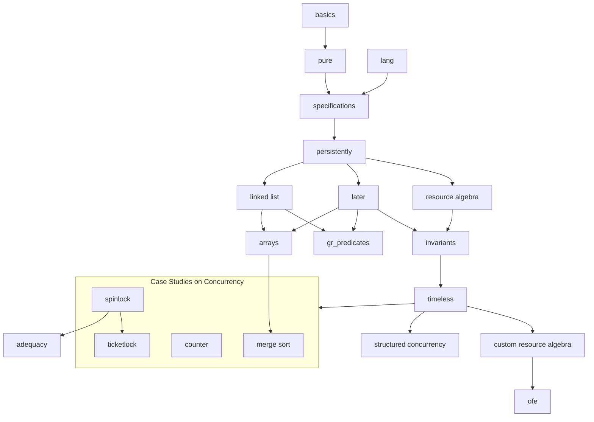

# Iris Tutorial
The Iris Tutorial is an introduction to the [Iris separation logic framework](https://iris-project.org/) and how to work with its [Coq formalization](https://gitlab.mpi-sws.org/iris/iris/).

The exposition is intended for a broad range of readers from advanced undergraduates to PhD students and researchers. We assume that readers are already motivated to learn Iris and thus present the material in a bottom-up fashion, rather than starting out with cool motivating examples. The tutorial material is intended to be self-contained. No specific background in logic or programming languages is assumed but some familiarity with basic programming languages theory and discrete mathematics will be beneficial, see e.g. [TAPL](https://www.cis.upenn.edu/~bcpierce/tapl/). Additionally, basic knowledge of the Coq proof assistant is assumed. Advanced Coq tactics have been purposefully kept to a minimum, and some proofs are longer than necessary to facilitate learning. We demonstrate more advanced tactics in chapter [ticket_lock_advanced](/theories/ticket_lock_advanced.v).

The tutorial comes in two versions:

- The folder `exercises`: a skeleton development with exercises left admitted.
- The folder `theories`: the full development with solutions.

The tutorial consists of several chapters, each corresponding to a Coq file. The graph in [Chapter Dependencies](README.md#chapter-dependencies) illustrates possible ways to go through the tutorial. However, the recommended order is specified in the [Recommended Learning Path](README.md#recommended-learning-path).

## Setup
This version is known to compile with

- Coq 8.19.2
- Iris 4.2.0

The recommended way to install the dependencies is through [opam](https://opam.ocaml.org/doc/Install.html).

1. Install [opam](https://opam.ocaml.org/doc/Install.html) if not already installed (a version greater than 2.0 is required).
2. Install a new switch and link it to the project.
```
opam switch create iris_tutorial 5.2.0
opam switch link iris_tutorial .
```
3. Add the Coq opam repository.
```
opam repo add coq-released https://coq.inria.fr/opam/released
opam repo add iris-dev https://gitlab.mpi-sws.org/iris/opam.git
opam update
```
4. Install the right version of the dependencies as specified in the `iris-tutorial.opam` file.
```
opam install . --deps-only
```

## Editor
Iris makes extensive use of Unicode characters. [This guide](https://gitlab.mpi-sws.org/iris/iris/-/blob/master/docs/editor.md) describes how to set up your favorite editor.

## Chapter Overview
- [basics](/exercises/basics.v) - Introduction to the separation
  logic and the Iris Proof Mode
- [pure](/exercises/pure.v) - Distinction between the Coq context and the Iris context
- [lang](/exercises/lang.v) - Introduction to HeapLang
- [specifications](/exercises/specifications.v) - Weakest precondition,
  basic resources, Hoare triples, and basic concurrency
- [persistently](/exercises/persistently.v) - The persistently modality
- [linked_lists](/exercises/linked_lists.v) - Linked lists
- [later](/exercises/later.v) - The later modality and recursive functions
- [arrays](/exercises/arrays.v) - Arrays in HeapLang
- [gr_predicates](/exercises/gr_predicates.v) - Guarded Recursive Predicates
- [resource_algebra](/exercises/resource_algebra.v) - Introduction to resource algebras
- [invariants](/exercises/invariants.v) - Invariants
- [timeless](/exercises/timeless.v) - Timeless propositions
- [structured_conc](/exercises/structured_conc.v) - Introducing the spawn and par constructs
- [counter](/exercises/counter.v) - The authoritative camera
- [spin_lock](/exercises/spin_lock.v) - Specification of a spin lock
- [ticket_lock](/exercises/ticket_lock.v) - Specification of a ticket lock
- [ticket_lock_advanced](/theories/ticket_lock_advanced.v) - Advanced Coq tactics
- [adequacy](/exercises/adequacy.v) - Adequacy
- [merge_sort](/exercises/merge_sort.v) - Merge sort
- [custom_ra](/exercises/custom_ra.v) - Defining resource algebras from scratch
- [ofe](/exercises/ofe.v) - Detailed introduction to OFEs

## Chapter Dependencies


## Recommended Learning Path
To get a good understanding of the fundamental concepts of Iris, it is recommended to study the following chapters in the given order.

1. [basics](/exercises/basics.v)
2. [pure](/exercises/pure.v)
3. [lang](/exercises/lang.v)
4. [specifications](/exercises/specifications.v)
5. [persistently](/exercises/persistently.v)
6. [linked_lists](/exercises/linked_lists.v)
7. [later](/exercises/later.v)
8. [arrays](/exercises/arrays.v)
9. [resource_algebra](/exercises/resource_algebra.v)
10. [invariants](/exercises/invariants.v)
11. [timeless](/exercises/timeless.v)
12. [structured_conc](/exercises/structured_conc.v)
13. [counter](/exercises/counter.v)
14. [spin_lock](/exercises/spin_lock.v)
15. [ticket_lock](/exercises/ticket_lock.v)
16. [adequacy](/exercises/adequacy.v)

## Exercises
To work on the exercises, simply edit the files in the `exercises/` folder. Some proofs and definitions are admitted and marked as `(* exercise *)`---your task is to fill in those definitions and complete the proofs all the way to `Qed`.

After you are done with a file, run `make` (with your working directory being the repository root, where the `Makefile` is located) to compile and check the exercises.

If you are stuck, you can find solutions in the corresponding file in the `theories/` folder.

## Documentation
This [cheatsheet](/cheatsheet.md) contains a table of the most important tactics for each logical connective. A full description of the Iris Proof Mode tactics can be found in the files [proof_mode.md](https://gitlab.mpi-sws.org/iris/iris/-/blob/master/docs/proof_mode.md) and [heap_lang.md](https://gitlab.mpi-sws.org/iris/iris/-/blob/master/docs/heap_lang.md).

## Optional Reading

Currently, the [Iris Lecture Notes](https://iris-project.org/tutorial-material.html) cover all the material presented in this tutorial and more. The lecture notes are not required to work through the tutorial, but readers may want to refer to the lecture notes for additional/alternative explanations of introduced concepts.

In its current state, this tutorial does not go over the underlying model of Iris. For readers who wish to learn about the underlying model of Iris, we refer to the [Iris from the ground up](https://people.mpi-sws.org/~dreyer/papers/iris-ground-up/paper.pdf) paper. Advanced readers may read this paper prior to going through the tutorial. However, it is generally recommended to study it afterwards, given its technical nature.

## Contributing

The hope is that the maintenance and extension of this tutorial becomes a collaborative community effort. We warmly welcome all contributions—whether it's correcting a typo, improving clarity, or extending the tutorial with new chapters.

If you have suggestions for future topics or improvements for existing ones, please add them to [TODO.md](TODO.md).

**Note**: by contributing to the Iris Tutorial you agree that your contributions will be released under the terms of Iris Tutorial's license — see [the LICENSE file](LICENSE).

### How to Contribute

To contribute, we recommend following these steps:

1. Fork the repository.
2. Create a new branch on the forked repository.
3. Make your changes in the branch.
4. Commit and push your changes.
5. Open a pull request to the main repository

For more detailed instructions, see [first-contributions](
https://github.com/firstcontributions/first-contributions).

### CoqdocJS
This tutorial uses [CoqdocJS](https://github.com/coq-community/coqdocjs), so please make sure to format your changes accordingly. To see what your changes will look like in the documentation, run
```
git submodule update --init
make html
```
Then open `html/toc.html` in a browser, and navigate to the chapter(s) containing your changes.

### Generating the Exercises
Note that the files in `exercises/` are generated from the corresponding files in `theories/`. As such, if you wish to make changes to a chapter, please make those changes to the `theories`-version of the chapter. Afterwards, the `exercises`-version can be re-generated by running `make exercises`. This requires `gawk` to be installed (which should be available on Linux, and on macOS can be installed via `brew install gawk`).

The syntax for the solution files is as follows:

    (* SOLUTION *) Proof.
      solution here.
    Qed.

is replaced by

    Proof.
      (* exercise *)
    Admitted.

and the more powerful

    (* BEGIN SOLUTION *)
      solution here.
    (* END SOLUTION BEGIN TEMPLATE
      exercise template here.
    END TEMPLATE *)

is replaced by

      exercise template here.

### Contact
If you have specific requests or questions about the tutorial, please contact:

**Amin Timany**\
Aarhus University\
<timany@cs.au.dk>

### Contributors
Below is a list of people who have contributed to the tutorial, sorted by last name. If you have contributed to the project, please add yourself to the list.

**Lars Birkedal**\
Aarhus University\
<birkedal@cs.au.dk>

**Simon Gregersen**\
Aarhus University\
<gregersen@cs.au.dk>

**Mathias Adam Møller**\
Aarhus University\
<mathias.adam.moeller@gmail.com>

**Mathias Pedersen**\
Aarhus University\
<mathiasp9999@gmail.com>

**Amin Timany**\
Aarhus University\
<timany@cs.au.dk>
