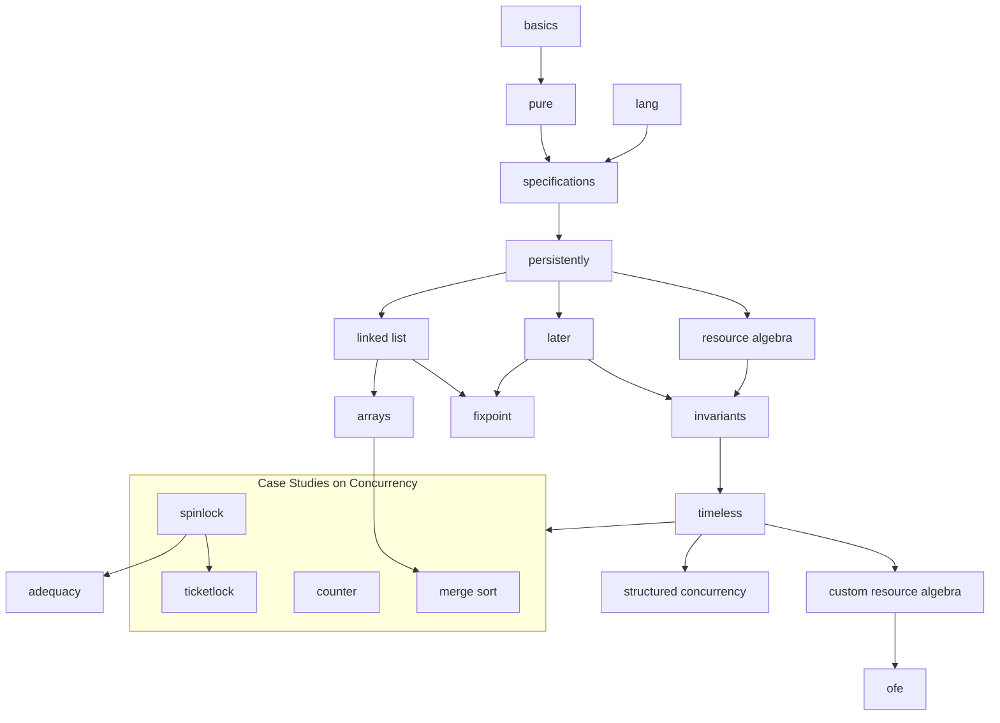

# Iris Tutorial
The Iris Tutorial is an introduction to the [Iris separation logic framework](https://iris-project.org/) and how to work with its [Coq formalization](https://gitlab.mpi-sws.org/iris/iris/).

The exposition is intended for a broad range of readers from advanced undergraduates to PhD students and researchers. In its current form, the tutorial material is intended as a supplement to the [Iris Lecture Notes](https://iris-project.org/tutorial-material.html). No specific background in logic or programming languages is assumed but some familiarity with basic programming languages theory and discrete mathematics will be beneficial, see e.g. [TAPL](https://www.cis.upenn.edu/~bcpierce/tapl/).

The tutorial comes in two versions:

- The folder `exercises`: a skeleton development with exercises left admitted.
- The folder `theories`: the full development with solutions.

The tutorial consists of several chapters, each corresponding to a Coq file. The graph in [Chapter Dependencies](README.md#chapter-dependencies) illustrates possible ways to go through the tutorial. However, the recommended order is specified in [Overview](README.md#overview).

## Setup
This version is known to compile with

- Coq 8.19.2
- Iris 4.2.0

The recommended way to install the dependencies is through [opam](https://opam.ocaml.org/doc/Install.html).

1. Install [opam](https://opam.ocaml.org/doc/Install.html) if not already installed (a version greater than 2.0 is required).
2. Install a new switch and link it to the project.
```
opam switch create iris_tutorial 5.2.0
opam switch link iris_tutorial .
```
3. Add the Coq opam repository.
```
opam repo add coq-released https://coq.inria.fr/opam/released
opam repo add iris-dev https://gitlab.mpi-sws.org/iris/opam.git
opam update
```
4. Install the right version of the dependencies as specified in the `iris-tutorial.opam` file.
```
opam install . --deps-only
```

## Editor
Iris makes extensive use of Unicode characters. [This guide](https://gitlab.mpi-sws.org/iris/iris/-/blob/master/docs/editor.md) describes how to set up your favorite editor.

## Overview
- [basics](/exercises/basics.v) - Introduction to the separation
  logic and the Iris Proof Mode
  - [pure](/exercises/pure.v) - Distinction between the Coq context and the Iris context
- [lang](/exercises/lang.v) - Introduction to HeapLang
- [specifications](/exercises/specifications.v) - Weakest precondition,
  basic resources, and Hoare triples
- [persistently](/exercises/persistently.v) - The persistently modality
- [linked_lists](/exercises/linked_lists.v) - Linked lists
  - [fixpoint](/exercises/fixpoint.v) - Fixpoints of propositions
- [arrays](/exercises/arrays.v) - Arrays in HeapLang
- [later](/exercises/later.v) - The later modality and recursive functions
- [resource_algebra](/exercises/resource_algebra.v) - Introduction to resource algebras
- [invariants](/exercises/invariants.v) - Invariants
- [timeless](/exercises/timeless.v) - Timeless propositions
- [structured_conc](/exercises/structured_conc.v) - Introducing the spawn and par constructs
- [counter](/exercises/counter.v) - The authoritative camera
- [spin_lock](/exercises/spin_lock.v) - Specification of a spin lock
- [ticket_lock](/exercises/ticket_lock.v) - Specification of a ticket lock
- [adequacy](/exercises/adequacy.v) - Adequacy
- [merge_sort](/exercises/merge_sort.v) - Merge sort
- [custom_ra](/exercises/custom_ra.v) - Defining resource algebras from scratch
- [ofe](/exercises/ofe.v) - Detailed introduction to OFEs

## Chapter Dependencies


## Exercises
To work on the exercises, simply edit the files in the `exercises/` folder. Some proofs and definitions are admitted and marked as `(* exercise *)`---your task is to fill in those definitions and complete the proofs all the way to `Qed`. 

After you are done with a file, run `make` (with your working directory being the repository root, where the `Makefile` is located) to compile and check the exercises.

If you are stuck, you can find solutions in the corresponding file in the `theories/` folder.

## Documentation
This [cheatsheet](/cheatsheet.md) contains a table of the most important tactics for each logical connective. A full description of the Iris Proof Mode tactics can be found in the files [proof_mode.md](https://gitlab.mpi-sws.org/iris/iris/-/blob/master/docs/proof_mode.md) and [heap_lang.md](https://gitlab.mpi-sws.org/iris/iris/-/blob/master/docs/heap_lang.md).

## Optional Reading
In its current state, this tutorial does not go over the underlying model of Iris. For readers who wish to learn about the underlying model of Iris, we refer to the [Iris from the ground up](https://people.mpi-sws.org/~dreyer/papers/iris-ground-up/paper.pdf) paper. Advanced readers may read this paper prior to going through the tutorial. However, it is generally recommended to study it afterwards, given its technical nature.

## Generating the exercises
If you want to contribute to the tutorial, note that the files in `exercises/` are generated from the corresponding files in `theories/`. Run `make exercises` to re-generate those files. This requires `gawk` to be installed (which should be available on Linux, and on macOS can be installed via `brew install gawk`).

The syntax for the solution files is as follows:

    (* SOLUTION *) Proof.
      solution here.
    Qed.

is replaced by

    Proof.
      (* exercise *)
    Admitted.

and the more powerful

    (* BEGIN SOLUTION *)
      solution here.
    (* END SOLUTION BEGIN TEMPLATE
      exercise template here.
    END TEMPLATE *)

is replaced by

      exercise template here.
