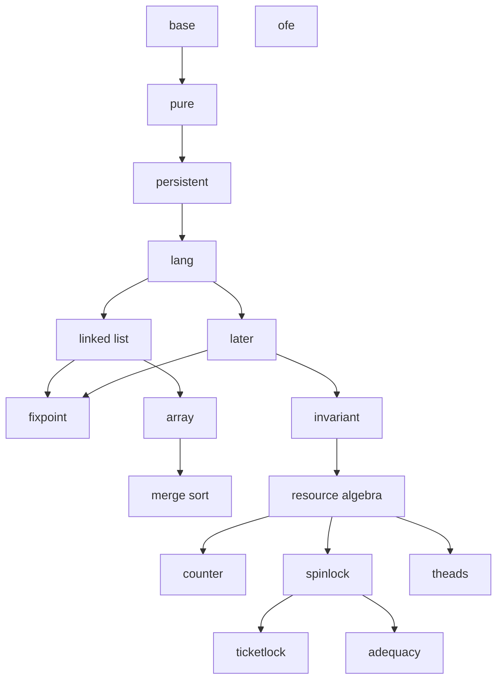

```mermaid
graph TD;
  base --> pure;
  pure --> pers[persistent];

  pers --> lang;
  lang --> later;

  lang --> linklist[linked list];
  linklist --> fix[fixpoint];
  later --> fix[fixpoint];
  linklist --> array;
  array --> merge[merge sort];

  later --> inv[invariant];
  inv --> ra[resource algebra];

  ra --> counter;
  ra --> spinlock;
  ra --> theads;
  spinlock --> ticketlock;

  spinlock --> adequacy;

  ofe;
```