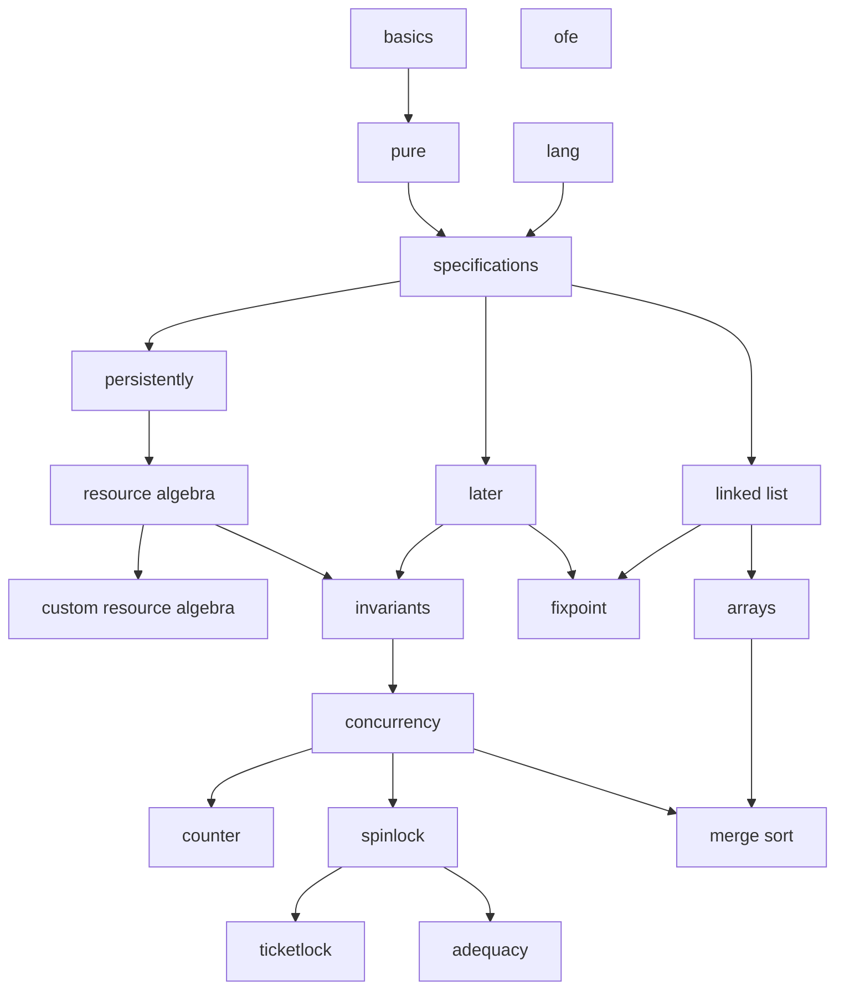

```mermaid
graph TD;
  basics --> pure;
  pure --> specs[specifications];
  lang --> specs;
  specs -->  pers[persistently];
  specs --> later;
  pers -->  ra[resource algebra];
  later --> invariants;
  ra --> cst_ra[custom resource algebra];
  ra --> invariants;
  invariants --> conc[concurrency];
  
  conc --> counter;
  conc --> spinlock;
  spinlock --> ticketlock;
  spinlock --> adequacy;

  specs --> linklist[linked list];
  later --> fix[fixpoint];
  linklist --> fix[fixpoint];

  linklist --> arrays;
  arrays --> merge[merge sort];
  conc --> merge;

  ofe;
```