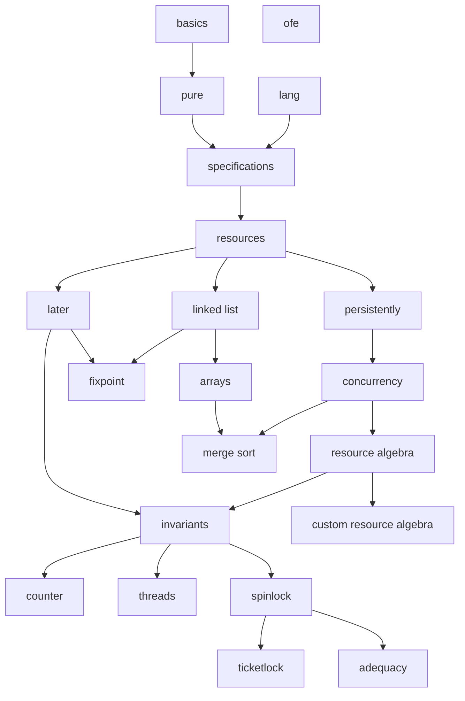

```mermaid
graph TD;
  basics --> pure;
  pure --> specs[specifications];
  lang --> specs;
  specs --> resources;
  resources --> pers[persistently];
  resources --> later;
  pers --> conc[concurrency];
  conc --> ra[resource algebra];
  later --> invariants;
  ra --> cst_ra[custom resource algebra];
  ra --> invariants;

  invariants --> counter;
  invariants --> threads;
  invariants --> spinlock;

  spinlock --> ticketlock;
  spinlock --> adequacy;

  resources --> linklist[linked list];
  later --> fix[fixpoint];
  linklist --> fix[fixpoint];

  linklist --> arrays;
  arrays --> merge[merge sort];
  conc --> merge;

  ofe;
```