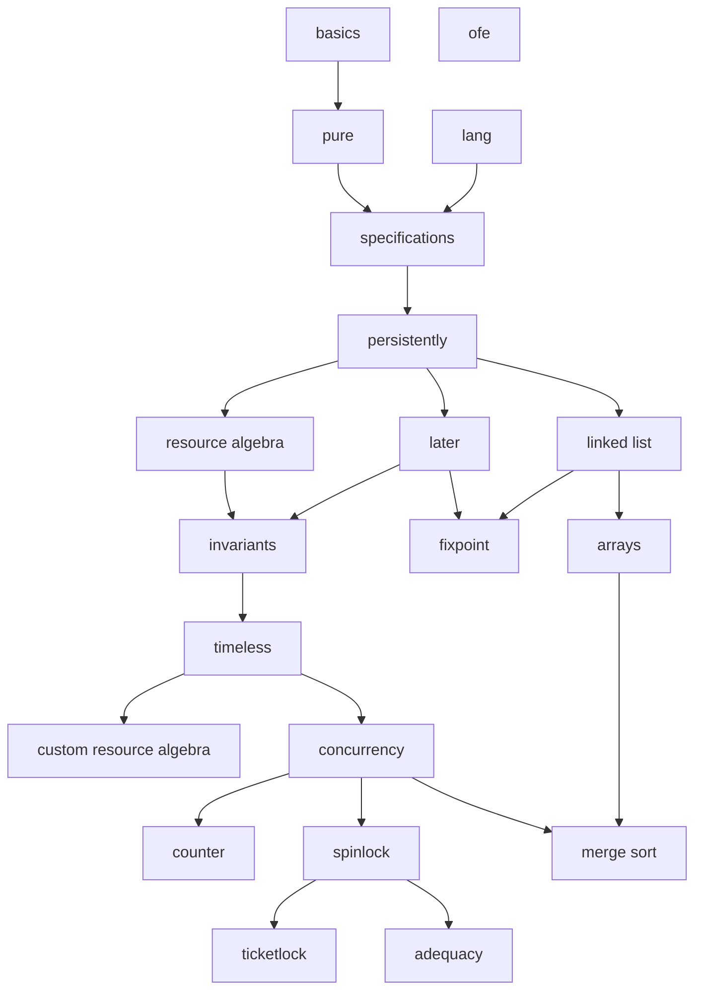

```mermaid
graph TD;
  basics --> pure;
  pure --> specs[specifications];
  lang --> specs;
  specs --> pers[persistently];
  pers -->  ra[resource algebra];
  pers --> later;
  pers --> linklist[linked list];
  later --> invariants;
  later --> fix;

  ra --> invariants;
  invariants --> timeless;
  timeless --> cst_ra[custom resource algebra];
  timeless --> conc[concurrency];
  
  conc --> counter;
  conc --> spinlock;
    spinlock --> ticketlock;
    spinlock --> adequacy;

  linklist --> fix[fixpoint];
  linklist --> arrays;

  conc --> merge;
  arrays --> merge[merge sort];
  ofe;
```