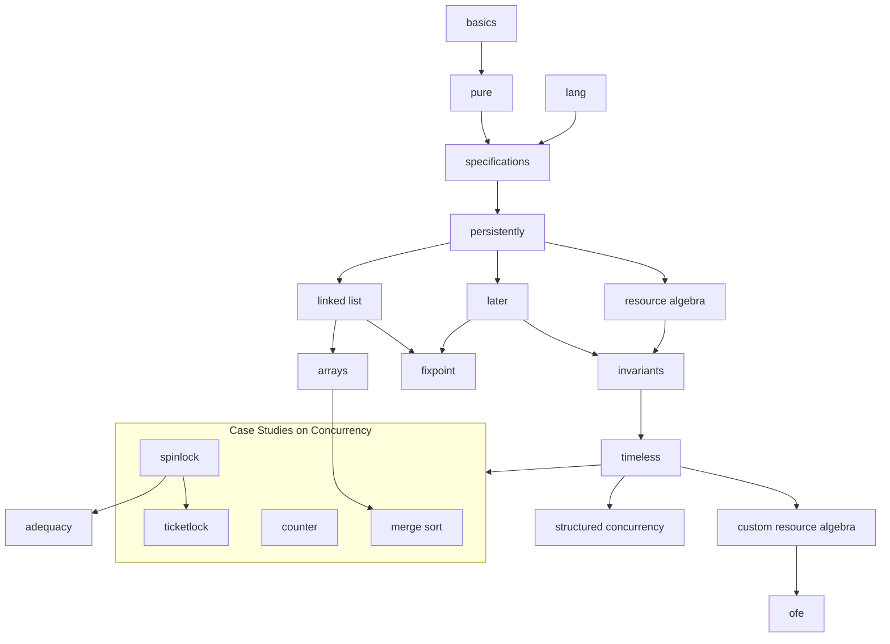

```mermaid
graph TD;
  basics --> pure;
  pure --> specs[specifications];
  lang --> specs;
  specs --> pers[persistently];
  pers -->  ra[resource algebra];
  pers --> later;
  pers --> linklist[linked list];

  ra --> invariants;

  later --> invariants;
  later --> fix[fixpoint];

  linklist --> fix;
  linklist --> arrays;

  invariants --> timeless;

  arrays --> merge[merge sort];

  timeless --> cst_ra[custom resource algebra];
  timeless --> strconc[structured concurrency];
  timeless --> ccs;

  subgraph ccs[Case Studies on Concurrency]
  counter;
  spinlock;
  ticketlock;
  merge;
  spinlock --> ticketlock;
  end

  spinlock --> adequacy;
  cst_ra --> ofe;
```